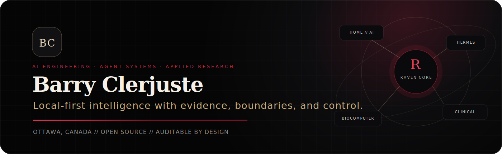
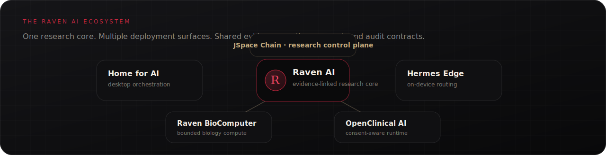

  

  
  
  
  

<h2 align="center">AI Engineer · Agent Systems · Applied Research</h2>

  I build local-first AI systems for scientific workflows, healthcare prototypes, edge inference, and auditable agent orchestration.
  My work emphasizes evidence, consent, reproducibility, benchmark discipline, and human control.

  <strong>Ottawa, Canada</strong> · Open to AI engineering roles, research collaborations, and ambitious product teams

---

## Selected systems

| System | What it demonstrates | Maturity | Live case study |
|---|---|---:|---|
| **[Home for AI](https://github.com/simpliibarrii-crypto/home-for-ai)** | React + Tauri command workspace for coordinating agents, local models, knowledge, and evidence traces | Active flagship redesign | **[Launch demo ↗](https://simpliibarrii-crypto.github.io/project.html?project=home-for-ai)** |
| **[Raven AI](https://github.com/simpliibarrii-crypto/raven-ai)** | Evidence Graphs, token-efficient agent policy, scientific run gates, and reproducible research workflows | Active research platform | **[Build an evidence trace ↗](https://simpliibarrii-crypto.github.io/project.html?project=raven-ai)** |
| **[Hermes Edge](https://github.com/simpliibarrii-crypto/hermes-edge)** | Device-aware routing across deterministic tools, local models, GPU delegates, and benchmark-gated fallbacks | Active v0.3 | **[Test the routing policy ↗](https://simpliibarrii-crypto.github.io/project.html?project=hermes-edge)** |
| **[OpenClinical AI](https://github.com/simpliibarrii-crypto/openclinical-ai)** | Consent-aware requests, tenant boundaries, signed model manifests, structured handoffs, and audit events | Development-preview MVP | **[Run the handoff demo ↗](https://simpliibarrii-crypto.github.io/project.html?project=openclinical-ai)** |
| **[Raven BioComputer](https://github.com/simpliibarrii-crypto/simpliibarrii-crypto-raven-biocomputer)** | Bounded biology tools, isolated run workspaces, hashed artifacts, and reproducible receipts | Alpha research software | **[Analyze a sequence ↗](https://simpliibarrii-crypto.github.io/project.html?project=raven-biocomputer)** |
| **JSpace Chain** | Observable, capacity-bounded agent control plane for routing, risk gates, reflection, and tamper-evident audit | Private research prototype | **[Inspect the policy demo ↗](https://simpliibarrii-crypto.github.io/project.html?project=jspace-chain)** |

  

## Engineering approach

<table>
<tr>
<td width="25%" valign="top">
<strong>Evidence before confidence</strong>  
Claims carry sources, confidence, risk, verification steps, and inspectable traces.
</td>
<td width="25%" valign="top">
<strong>Local before remote</strong>  
Deterministic tools and on-device models handle suitable work before cloud escalation.
</td>
<td width="25%" valign="top">
<strong>Boundaries before autonomy</strong>  
Consent, tenant isolation, policy gates, and human approval define agent authority.
</td>
<td width="25%" valign="top">
<strong>Benchmarks before claims</strong>  
Performance language is tied to device, backend, memory, thermal state, and reproducible metrics.
</td>
</tr>
</table>

## Technical range

**Languages and application layers**

**AI systems and infrastructure**

## Research and papers

I study current AI-systems research, separate demonstrated findings from engineering inference, and turn useful properties into testable contracts, prototypes, and browser demonstrations.

| Research direction | Current form |
|---|---|
| **Observable Global Workspaces for Auditable Agent Systems** | Working paper and private JSpace Chain prototype |
| **Evidence Graphs and Token-Efficient Scientific Agents** | Manuscript in preparation through Raven AI |
| **Benchmark-Gated Routing for On-Device Agent Inference** | Hermes Edge engineering report and benchmark contract |
| **Bounded Computers for Reproducible Biology Agents** | Raven BioComputer technical paper draft |
| **Consent-Gated Clinical AI Runtimes** | OpenClinical AI applied case study |
| **Retrieval Routing and Accelerated Agent Execution** | LangChain NVIDIA integration study, clearly attributed to upstream work |

  <a href="https://simpliibarrii-crypto.github.io/research.html"><strong>Open the complete research archive →</strong></a>

## What I bring to a team

- Product-focused AI engineering across Python services, TypeScript interfaces, Rust/Tauri desktop applications, and containerized workflows.
- Practical healthcare context paired with deliberate caution around consent, privacy, clinical claims, and human review.
- Research-to-product translation that preserves source attribution and marks assumptions instead of polishing them into false certainty.
- A systems mindset centered on reproducibility, observability, deployment constraints, and useful operator experience.

## Current focus

- Turning **Home for AI** into the visual command surface for the full ecosystem.
- Hardening Raven's Evidence Graph, Token Economy, and scientific publishability contracts.
- Testing edge-routing policies across realistic memory and hardware constraints.
- Expanding the public portfolio with honest, credential-free demonstrations employers can inspect immediately.

---

  <strong>Build intelligence with a spine.</strong> 
  AI engineering · agent systems · local inference · scientific and healthcare prototypes

  <a href="mailto:simpliibarrii@outlook.com">Email</a>
  &nbsp;·&nbsp;
  <a href="https://simpliibarrii-crypto.github.io/">Portfolio</a>
  &nbsp;·&nbsp;
  <a href="https://www.linkedin.com/in/barry-clerjuste-4ab72b226">LinkedIn</a>
  &nbsp;·&nbsp;
  <a href="https://huggingface.co/bclermo">Hugging Face</a>

