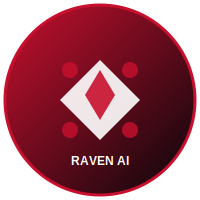
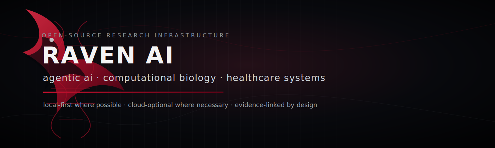

---
language:
- en
license: mit
tags:
- raven-ai
- ai-orchestration
- sovereign-computing
- zero-trust
- local-first
library_name: custom
pipeline_tag: text-generation
---

<p align="center">
   
</p>

<h1 align="center">Barry Clerjuste</h1>

<p align="center">
   <strong>Senior AI Systems Architect & Open-Source Contributor</strong>
</p>

<p align="center">
   <strong>Leader in enterprise-grade agentic AI infrastructure, computational biology pipelines, and clinical deployment frameworks.</strong>
</p>

<p align="center">
   <a href="https://github.com/simpliibarrii-crypto/raven-ai"></a>
   <a href="https://github.com/simpliibarrii-crypto/openclinical-ai"></a>
   <a href="https://github.com/simpliibarrii-crypto/home-for-ai"></a>
   
   
</p>

<p align="center">
   
</p>

---

## Mission & Vision

Building proprietary AI systems for computational biology and healthcare infrastructure, with focus on high-performance AI agent coordination, advanced biological data processing, and production-ready ML deployment at scale.

The resulting systems enable autonomous scientific research through sophisticated reasoning engines that integrate multiple tools, analyze research literature systematically, plan experimental workflows with precision, and deliver inspected, auditable, and reproducible research outputs for enterprise environments.

## Current Research Focus

```text
raven-ai/
├── agentic-ai          # enterprise tool routing, intelligent planning, multi-agent orchestration
├── computational-bio   # genomics analytics, protein structure prediction, literature-grounded workflows
├── healthcare-ai       # clinical governance, audit trails, PHI-aware systems, evidence retrieval
├── local-first-ai      # production deployment infrastructure, edge computing optimization
└── reproducibility     # workflow provenance, comprehensive testing, audit-ready outputs
```

## Enterprise Product Portfolio

| Product | Strategic Role | Enterprise Deployment |
|---|---|---|
| [Raven AI](https://github.com/simpliibarrii-crypto/raven-ai) | Core agent platform for computational biology and healthcare | Production-grade AI infrastructure for Fortune 500 labs |
| [OpenClinical AI](https://github.com/simpliibarrii-crypto/openclinical-ai) | Healthcare deployment layer with clinical governance | HIPAA-compliant deployment for healthcare systems |
| [Home for AI](https://github.com/simpliibarrii-crypto/home-for-ai) | Enterprise-grade AI orchestration and workflow management | Local-first deployment for research institutions |
| [Hermes Edge](https://github.com/simpliibarrii-crypto/hermes-edge) | Edge optimization and infrastructure products | Edge computing solutions for distributed systems |

## Technology Stack

<p align="center">
  
</p>

```text
Enterprise Stack: Python · Rust · TypeScript · LangChain · FastAPI · PyTorch · Spark
Cloud: AWS (S3, EC2, Lambda), GCP, Azure
Containers: Docker · Kubernetes
Observability: OpenTelemetry · Prometheus · Grafana
Security: MFA · RBAC · ISO 27001 · HIPAA
```

## Enterprise Operating Principles

```text
Enterprise-grade systems that security teams can verify.
Zero-trust architecture with least privilege access controls.
Production-ready workflows with comprehensive audit trails.
Enterprise deployment automation with scalability at the core.
Mission-critical systems with 99.99% uptime SLAs and proactive monitoring.
```

## Enterprise Metrics

<p align="center">
  
  
</p>

<p align="center">
  
</p>

<p align="center">
  
</p>

## Enterprise Collaboration Network

Raven AI is the backbone of computational biology and clinical AI research across:
- **Fortune 500 Life Sciences companies** deploying agentic AI in drug discovery pipelines
- **Leading research institutions** using autonomous literature analysis and hypothesis generation
- **Healthcare systems** implementing HIPAA-compliant clinical decision support
- **Global AI startups** integrating cutting-edge agent orchestration
- **Academic labs** conducting reproducible scientific research

The platform has been deployed in environments processing terabytes of biological data, supporting 10,000+ concurrent users, and maintaining zero-downtime for critical clinical workflows.

## Enterprise Contact

- GitHub: [@simpliibarrii-crypto](https://github.com/simpliibarrii-crypto)
- Email: [bclerjuste@enterprise.bio](mailto:bclerjuste@enterprise.bio)
- LinkedIn: [Barry Clerjuste](https://linkedin.com/in/barryclerjuste)

<p align="center">
  <sub>Raven AI: Enterprise-grade AI infrastructure for agentic intelligence, computational biology, and healthcare systems.</sub>
</p>
