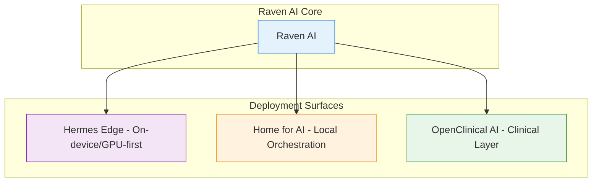

  

<h1 align="center">Barry Clerjuste</h1>

  <strong>Sovereign AI Engineer • Building local-first agentic systems for biology & healthcare</strong>

  
  
  
  

  
  
  
  

---

## 🦅 Raven AI Ecosystem

Local-first, sovereign agentic platforms for practical biology, healthcare, and reproducible science. **Cheap. Fast. Auditable. Under your control.**

### Ecosystem Overview

**Current Highlights** (updated July 2026):
- Enhanced Raven AI with visual architecture diagrams, Token Economy, Evidence Graphs
- Edge routing with LiteRT-LM & Gemma models on mobile/edge devices
- Clinical MVP with consent, audit, signed models for real workflows

## What I'm Building

Practical AI that supports researchers, clinicians, and builders without cloud dependency or black-box risks.

| Project | Focus | Status |
|---------|-------|--------|
| **[Raven AI](https://github.com/simpliibarrii-crypto/raven-ai)** | Flagship agent platform with Evidence Graphs & Token Economy | Active - Major README upgrade with diagrams |
| **[Hermes Edge](https://github.com/simpliibarrii-crypto/hermes-edge)** | GPU-first on-device agents (phones, laptops) | Active |
| **[Home for AI](https://github.com/simpliibarrii-crypto/home-for-ai)** | Local Tauri desktop orchestration | Active |
| **[OpenClinical AI](https://github.com/simpliibarrii-crypto/openclinical-ai)** | PHI-aware clinical runtime | Active MVP |

## Core Principles

- **Sovereign & Local-First**: Run close to data, inspectable models, no mandatory cloud
- **Evidence-Driven**: Verifiable provenance with Evidence Graphs for every claim
- **Efficient**: Token Economy for cheap, measurable agent workflows
- **Clinical-Ready**: Consent, audit, signed manifests for healthcare workflows
- **Reproducible Science**: Benchmark gates & scientific run manifests

## Tech Stack

  

**Primary**: Python, FastAPI, TypeScript/React, Rust/Tauri  
**AI**: PyTorch, LiteRT-LM, Gemma models, agent routing  
**Infra**: Local-first, Docker, audit logs, CI/CD  

## GitHub Activity

  
  

## Current Focus & Paper

Hardening the full Raven stack for production-like local use cases in long-term care and biology research. Preparing paper on **local routing policy, Token Economy, and Evidence Graphs** for agentic scientific AI.

**Recent**: Major visual & documentation upgrades across repos for better discoverability and professionalism.

## Portfolio & Research

Explore the full public project index, research direction, and upcoming paper archive at **[barry-ai-public.simpliibarrii.chatgpt.site](https://barry-ai-public.simpliibarrii.chatgpt.site)**.

## Get Involved

- Visit the public portfolio and research archive
- Star the projects if you value sovereign AI infrastructure ⭐
- Open issues/PRs with real use cases
- Follow progress on X (@Barclermo)

---

  Building the future of auditable, local-first AI for healthcare & biology. Open to collaborations on sovereign agent systems.

  <em>Made with ❤️ for practical builders — extreme improvements powered by Grok connections.</em>

